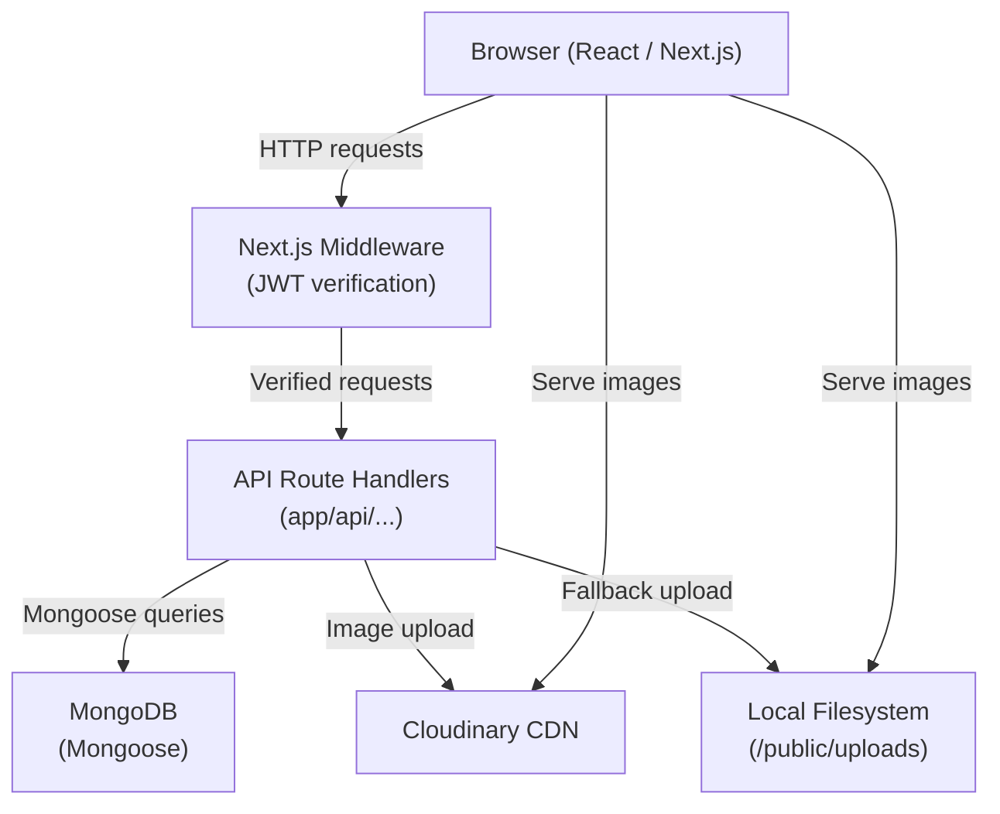
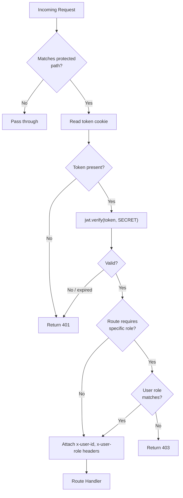
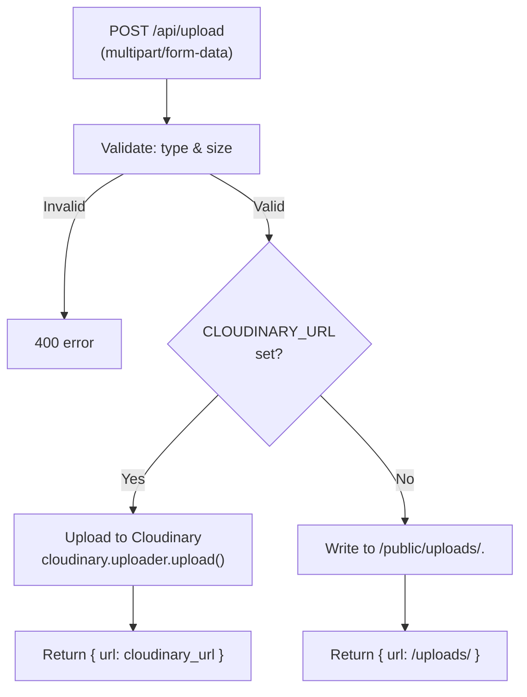

# Design Document: Blog Platform

## Overview

The Blog Platform is a full-stack web application built with **Next.js 14 (App Router)** and **TypeScript**. It supports two user roles — Authors and Readers — with JWT-based authentication stored in HTTP-only cookies, rich text post creation via TipTap, image uploads to Cloudinary (with a local filesystem fallback), comments, likes, and full-text search. All backend logic lives in Next.js API Route Handlers (`app/api/...`). MongoDB is the data store, accessed through Mongoose. The UI is styled with Tailwind CSS and supports dark mode.

### Key Technology Choices

| Concern | Choice | Rationale |
|---|---|---|
| Framework | Next.js 14 App Router | File-based routing, server components, built-in API routes |
| Language | TypeScript | Type safety across frontend and backend |
| Database | MongoDB + Mongoose | Flexible document model; Mongoose provides schema validation |
| Auth | JWT in HTTP-only cookies | Stateless; cookie storage prevents XSS token theft |
| Rich text | TipTap | Headless, extensible, outputs HTML or JSON; React-friendly |
| Image upload | Cloudinary (primary) / local `/public/uploads` (fallback) | Zero-config CDN when env var present; graceful local fallback |
| Styling | Tailwind CSS | Utility-first; responsive breakpoints built in |
| State management | React Context + `useReducer` | Sufficient for auth state; avoids extra dependency |
| Validation | Zod | Schema-first; works on both client and server |
| HTML sanitisation | DOMPurify (server-side via `isomorphic-dompurify`) | Prevents stored XSS in rich text content |

---

## Architecture

### High-Level Diagram



### Request Lifecycle

1. Browser sends a request (page navigation or `fetch`).
2. **Next.js Middleware** (`middleware.ts`) intercepts requests matching `/api/posts*`, `/api/comments*`, `/api/posts/:id/like`, and `/dashboard/*`. It reads the `token` HTTP-only cookie, verifies the JWT, and attaches the decoded payload to a request header (`x-user-id`, `x-user-role`). Unauthenticated requests receive `401`; insufficient-role requests receive `403`.
3. The **API Route Handler** receives the request, validates the body with Zod, calls the appropriate service function, and returns a JSON response.
4. Service functions interact with **Mongoose models** to read/write MongoDB.
5. The **Upload Service** conditionally routes to Cloudinary or the local filesystem based on the `CLOUDINARY_URL` environment variable.

### Rendering Strategy

| Route | Strategy | Reason |
|---|---|---|
| `/` (Home) | Client Component with `useEffect` fetch | Requires interactive search/pagination |
| `/posts/[id]` | Server Component (RSC) | SEO-friendly; static-ish content |
| `/dashboard/*` | Client Components | Highly interactive; protected by middleware |
| `/login`, `/register` | Client Components | Form interaction |

---

## Components and Interfaces

### Frontend Page Components

```
app/
├── page.tsx                        # Home page — post list, search, pagination
├── posts/
│   └── [id]/
│       └── page.tsx                # Post detail — full content, comments, likes
├── dashboard/
│   ├── page.tsx                    # Author dashboard — my posts list
│   ├── new/
│   │   └── page.tsx                # Create post form
│   └── edit/
│       └── [id]/
│           └── page.tsx            # Edit post form
├── login/
│   └── page.tsx                    # Login form
└── register/
    └── page.tsx                    # Register form
```

### Shared UI Components

```
components/
├── auth/
│   ├── LoginForm.tsx
│   └── RegisterForm.tsx
├── posts/
│   ├── PostCard.tsx                # Title, excerpt, author, date — used on Home
│   ├── PostList.tsx                # Renders a list of PostCards with pagination
│   ├── PostDetail.tsx              # Full post content renderer
│   └── PostForm.tsx                # Create/edit form with TipTap editor
├── comments/
│   ├── CommentList.tsx
│   └── CommentForm.tsx
├── editor/
│   └── RichTextEditor.tsx          # TipTap wrapper component
├── ui/
│   ├── Navbar.tsx
│   ├── Toast.tsx
│   ├── LoadingSpinner.tsx
│   ├── Pagination.tsx
│   ├── DarkModeToggle.tsx
│   └── ConfirmDialog.tsx           # Confirmation prompt for destructive actions
└── providers/
    └── AuthProvider.tsx            # React Context for auth state
```

### API Route Handlers

```
app/api/
├── auth/
│   ├── register/route.ts
│   ├── login/route.ts
│   └── me/route.ts
├── posts/
│   ├── route.ts                    # GET (list/search), POST (create)
│   └── [id]/
│       ├── route.ts                # GET (single), PUT (update), DELETE
│       └── like/
│           └── route.ts            # POST (toggle like)
├── comments/
│   ├── route.ts                    # POST (create)
│   └── [postId]/
│       └── route.ts                # GET (list by post)
└── upload/
    └── route.ts                    # POST (image upload)
```

### Service Layer

```
lib/
├── db.ts                           # MongoDB connection with caching
├── auth.ts                         # JWT sign/verify helpers
├── services/
│   ├── authService.ts
│   ├── postService.ts
│   ├── commentService.ts
│   ├── likeService.ts
│   ├── uploadService.ts
│   └── searchService.ts
├── validation/
│   ├── authSchemas.ts              # Zod schemas for auth endpoints
│   ├── postSchemas.ts
│   └── commentSchemas.ts
└── sanitise.ts                     # DOMPurify wrapper for HTML sanitisation
```

---

## Data Models

### User

```typescript
// models/User.ts
import { Schema, model, models, Document } from 'mongoose';

export interface IUser extends Document {
  name: string;
  email: string;
  passwordHash: string;
  role: 'author' | 'reader';
  createdAt: Date;
  updatedAt: Date;
}

const UserSchema = new Schema<IUser>(
  {
    name:         { type: String, required: true, trim: true },
    email:        { type: String, required: true, unique: true, lowercase: true, trim: true },
    passwordHash: { type: String, required: true },
    role:         { type: String, enum: ['author', 'reader'], required: true },
  },
  { timestamps: true }
);

export const User = models.User || model<IUser>('User', UserSchema);
```

**Public profile projection** (never expose `passwordHash`):
```typescript
{ _id: 1, name: 1, email: 1, role: 1, createdAt: 1 }
```

---

### Post

```typescript
// models/Post.ts
import { Schema, model, models, Document, Types } from 'mongoose';

export interface IPost extends Document {
  title: string;
  content: string;          // Sanitised HTML
  excerpt: string;          // Auto-generated first 200 chars of plain text
  image?: string;           // URL (Cloudinary or relative path)
  status: 'draft' | 'published';
  author: Types.ObjectId;   // ref: 'User'
  likes: Types.ObjectId[];  // array of User IDs
  createdAt: Date;
  updatedAt: Date;
}

const PostSchema = new Schema<IPost>(
  {
    title:   { type: String, required: true, trim: true },
    content: { type: String, required: true },
    excerpt: { type: String },
    image:   { type: String },
    status:  { type: String, enum: ['draft', 'published'], default: 'draft' },
    author:  { type: Schema.Types.ObjectId, ref: 'User', required: true },
    likes:   [{ type: Schema.Types.ObjectId, ref: 'User' }],
  },
  { timestamps: true }
);

// Full-text search index on title and content
PostSchema.index({ title: 'text', content: 'text' });

export const Post = models.Post || model<IPost>('Post', PostSchema);
```

---

### Comment

```typescript
// models/Comment.ts
import { Schema, model, models, Document, Types } from 'mongoose';

export interface IComment extends Document {
  post:    Types.ObjectId;  // ref: 'Post'
  user:    Types.ObjectId;  // ref: 'User'
  content: string;
  createdAt: Date;
  updatedAt: Date;
}

const CommentSchema = new Schema<IComment>(
  {
    post:    { type: Schema.Types.ObjectId, ref: 'Post', required: true },
    user:    { type: Schema.Types.ObjectId, ref: 'User', required: true },
    content: { type: String, required: true, trim: true },
  },
  { timestamps: true }
);

export const Comment = models.Comment || model<IComment>('Comment', CommentSchema);
```

---

### JWT Payload

```typescript
interface JWTPayload {
  sub: string;   // User._id as string
  role: 'author' | 'reader';
  iat: number;
  exp: number;
}
```

---

## API Design

All endpoints return `application/json`. Error responses follow the shape:
```json
{ "error": "Human-readable message", "fields": { "fieldName": "reason" } }
```
The `fields` key is only present on `400` validation errors.

### Authentication

| Method | Path | Auth | Description |
|---|---|---|---|
| POST | `/api/auth/register` | None | Register new user |
| POST | `/api/auth/login` | None | Login, set JWT cookie |
| GET | `/api/auth/me` | JWT cookie | Get current user profile |

**POST `/api/auth/register`**
```
Request:  { name: string, email: string, password: string, role: "author"|"reader" }
Response 201: { id, name, email, role, createdAt }
Response 400: { error, fields }
Response 409: { error: "Email already registered" }
```

**POST `/api/auth/login`**
```
Request:  { email: string, password: string }
Response 200: { id, name, email, role }
  + Set-Cookie: token=<jwt>; HttpOnly; SameSite=Lax; Max-Age=604800
Response 400: { error, fields }
Response 401: { error: "Invalid credentials" }
```

**GET `/api/auth/me`**
```
Response 200: { id, name, email, role }
Response 401: { error: "Unauthorised" }
```

---

### Posts

| Method | Path | Auth | Role | Description |
|---|---|---|---|---|
| GET | `/api/posts` | None | Any | List/search published posts |
| POST | `/api/posts` | JWT | author | Create post |
| GET | `/api/posts/:id` | Optional | Any | Get single post |
| PUT | `/api/posts/:id` | JWT | author (owner) | Update post |
| DELETE | `/api/posts/:id` | JWT | author (owner) | Delete post |
| POST | `/api/posts/:id/like` | JWT | Any | Toggle like |

**GET `/api/posts`** — query params: `page`, `limit`, `search`
```
Response 200: {
  posts: Post[],
  page: number,
  limit: number,
  total: number,
  totalPages: number
}
```

**POST `/api/posts`**
```
Request:  { title: string, content: string, image?: string, status?: "draft"|"published" }
Response 201: Post
Response 400: { error, fields }
Response 403: { error: "Forbidden" }
```

**GET `/api/posts/:id`**
```
Response 200: Post & { author: { name: string } }
Response 403: { error: "Forbidden" }   // draft accessed by non-owner
Response 404: { error: "Post not found" }
```

**PUT `/api/posts/:id`**
```
Request:  Partial<{ title, content, image, status }>
Response 200: Post
Response 403: { error: "Forbidden" }
Response 404: { error: "Post not found" }
```

**DELETE `/api/posts/:id`**
```
Response 200: { message: "Post deleted" }
Response 403: { error: "Forbidden" }
Response 404: { error: "Post not found" }
```

**POST `/api/posts/:id/like`**
```
Response 200: { likes: number, liked: boolean }
Response 401: { error: "Unauthorised" }
Response 404: { error: "Post not found" }
```

---

### Comments

| Method | Path | Auth | Description |
|---|---|---|---|
| POST | `/api/comments` | JWT | Create comment |
| GET | `/api/comments/:postId` | None | List comments for post |

**POST `/api/comments`**
```
Request:  { postId: string, content: string }
Response 201: Comment & { user: { name: string } }
Response 400: { error, fields }
Response 404: { error: "Post not found" }
```

**GET `/api/comments/:postId`**
```
Response 200: Comment[]   // ordered by createdAt asc, user.name populated
Response 404: { error: "Post not found" }
```

---

### Upload

| Method | Path | Auth | Role | Description |
|---|---|---|---|---|
| POST | `/api/upload` | JWT | author | Upload image |

**POST `/api/upload`** — `multipart/form-data`, field name `image`
```
Response 200: { url: string }
Response 400: { error: "File too large" | "Unsupported file type" }
```

---

## Authentication Flow

### Registration and Login

```mermaid
sequenceDiagram
    participant C as Client
    participant API as API Route
    participant DB as MongoDB

    C->>API: POST /api/auth/register { name, email, password, role }
    API->>API: Zod validation
    API->>DB: Check email uniqueness
    DB-->>API: result
    API->>API: bcrypt.hash(password, 12)
    API->>DB: User.create(...)
    DB-->>API: saved user
    API-->>C: 201 { id, name, email, role }

    C->>API: POST /api/auth/login { email, password }
    API->>DB: User.findOne({ email })
    DB-->>API: user doc
    API->>API: bcrypt.compare(password, hash)
    API->>API: jwt.sign({ sub, role }, SECRET, { expiresIn: '7d' })
    API-->>C: 200 { id, name, email, role } + Set-Cookie: token=<jwt>; HttpOnly
```

### Middleware JWT Verification



The middleware sets custom headers so route handlers can read identity without re-verifying the JWT:
```typescript
// middleware.ts
request.headers.set('x-user-id', payload.sub);
request.headers.set('x-user-role', payload.role);
```

### Cookie Configuration

```typescript
cookies().set('token', jwt, {
  httpOnly: true,
  sameSite: 'lax',
  secure: process.env.NODE_ENV === 'production',
  maxAge: 60 * 60 * 24 * 7,  // 7 days
  path: '/',
});
```

---

## Image Upload Strategy



### Validation Rules

- Accepted MIME types: `image/jpeg`, `image/png`, `image/webp`
- Maximum file size: 5 MB (5 × 1024 × 1024 bytes)
- File size check happens before any I/O

### Cloudinary Integration

```typescript
import { v2 as cloudinary } from 'cloudinary';

cloudinary.config(); // reads CLOUDINARY_URL automatically

const result = await cloudinary.uploader.upload(tempFilePath, {
  folder: 'blog-platform',
  resource_type: 'image',
});
return result.secure_url;
```

### Local Fallback

```typescript
import { writeFile } from 'fs/promises';
import { join } from 'path';
import { randomUUID } from 'crypto';

const ext = file.type.split('/')[1];
const filename = `${randomUUID()}.${ext}`;
const dest = join(process.cwd(), 'public', 'uploads', filename);
await writeFile(dest, Buffer.from(await file.arrayBuffer()));
return `/uploads/${filename}`;
```

---

## Rich Text Editor Integration

TipTap is used as the rich text editor. It is headless (no default styles) and outputs HTML, which is stored in the `content` field after server-side sanitisation.

### Editor Configuration

```typescript
// components/editor/RichTextEditor.tsx
import { useEditor, EditorContent } from '@tiptap/react';
import StarterKit from '@tiptap/starter-kit';
import Link from '@tiptap/extension-link';
import Underline from '@tiptap/extension-underline';

const editor = useEditor({
  extensions: [
    StarterKit,          // bold, italic, headings H1-H3, lists, blockquote, code
    Link.configure({ openOnClick: false }),
    Underline,
  ],
  content: initialContent,
  onUpdate: ({ editor }) => onChange(editor.getHTML()),
});
```

### Supported Formatting

| Feature | TipTap Extension |
|---|---|
| Bold | StarterKit (Bold) |
| Italic | StarterKit (Italic) |
| Underline | `@tiptap/extension-underline` |
| Headings H1–H3 | StarterKit (Heading) |
| Ordered list | StarterKit (OrderedList) |
| Unordered list | StarterKit (BulletList) |
| Blockquote | StarterKit (Blockquote) |
| Hyperlinks | `@tiptap/extension-link` |

### Content Sanitisation

Before persisting, the server sanitises the HTML to prevent stored XSS:

```typescript
// lib/sanitise.ts
import DOMPurify from 'isomorphic-dompurify';

export function sanitiseHTML(dirty: string): string {
  return DOMPurify.sanitize(dirty, {
    ALLOWED_TAGS: ['p','br','strong','em','u','h1','h2','h3',
                   'ul','ol','li','blockquote','a','code','pre'],
    ALLOWED_ATTR: ['href', 'target', 'rel'],
  });
}
```

---

## State Management

Auth state is managed with a React Context + `useReducer` pattern. This is sufficient because:
- Auth state is global but simple (current user or null)
- No complex derived state or async middleware is needed
- Avoids adding Zustand/Redux as a dependency

```typescript
// components/providers/AuthProvider.tsx
interface AuthState {
  user: PublicUser | null;
  loading: boolean;
}

type AuthAction =
  | { type: 'SET_USER'; payload: PublicUser }
  | { type: 'CLEAR_USER' }
  | { type: 'SET_LOADING'; payload: boolean };

const AuthContext = createContext<{
  state: AuthState;
  dispatch: Dispatch<AuthAction>;
} | null>(null);
```

On app mount, `AuthProvider` calls `GET /api/auth/me` to hydrate the user from the existing cookie. Components consume `useAuth()` to read the current user and trigger login/logout.

---

## File and Folder Structure

```
blog-platform/
├── app/
│   ├── layout.tsx                  # Root layout — AuthProvider, Navbar, dark mode
│   ├── page.tsx                    # Home page
│   ├── globals.css
│   ├── posts/[id]/page.tsx
│   ├── dashboard/
│   │   ├── page.tsx
│   │   ├── new/page.tsx
│   │   └── edit/[id]/page.tsx
│   ├── login/page.tsx
│   ├── register/page.tsx
│   └── api/
│       ├── auth/
│       │   ├── register/route.ts
│       │   ├── login/route.ts
│       │   └── me/route.ts
│       ├── posts/
│       │   ├── route.ts
│       │   └── [id]/
│       │       ├── route.ts
│       │       └── like/route.ts
│       ├── comments/
│       │   ├── route.ts
│       │   └── [postId]/route.ts
│       └── upload/route.ts
├── components/
│   ├── auth/
│   ├── posts/
│   ├── comments/
│   ├── editor/
│   ├── ui/
│   └── providers/
├── models/
│   ├── User.ts
│   ├── Post.ts
│   └── Comment.ts
├── lib/
│   ├── db.ts
│   ├── auth.ts
│   ├── sanitise.ts
│   ├── services/
│   └── validation/
├── middleware.ts
├── public/
│   └── uploads/                    # Local image fallback directory
├── types/
│   └── index.ts                    # Shared TypeScript interfaces
├── tailwind.config.ts
├── next.config.ts
└── tsconfig.json
```

---

## Correctness Properties

*A property is a characteristic or behavior that should hold true across all valid executions of a system — essentially, a formal statement about what the system should do. Properties serve as the bridge between human-readable specifications and machine-verifiable correctness guarantees.*

Property-based testing is applicable here because the platform has significant pure-function logic: input validation (Zod schemas), HTML sanitisation, pagination calculations, like-toggle logic, and access-control checks. These all have clear input/output behavior and universal properties that hold across a wide input space. The chosen PBT library is **fast-check** (TypeScript-native, widely used with Jest/Vitest).

---

### Property 1: Valid registration always produces a public profile

*For any* valid combination of name, email, password, and role (`author` or `reader`), a POST to `/api/auth/register` SHALL return a `201` response whose body contains the same name, email, and role, and whose body does NOT contain the password or password hash.

**Validates: Requirements 1.1, 1.4**

---

### Property 2: Duplicate email registration is always rejected

*For any* valid user who has already been registered, a second POST to `/api/auth/register` with the same email SHALL return a `409` response, regardless of the name, password, or role supplied in the second request.

**Validates: Requirements 1.2**

---

### Property 3: Invalid registration payloads are always rejected with 400

*For any* registration payload that is missing a required field (`name`, `email`, `password`, or `role`), contains a malformed email, or contains a `role` value other than `author` or `reader`, the response SHALL be `400` with a structured error body that identifies the offending field(s).

**Validates: Requirements 1.3, 1.5**

---

### Property 4: Successful login always sets an HTTP-only cookie

*For any* registered user, a POST to `/api/auth/login` with the correct email and password SHALL return `200` and the response SHALL include a `Set-Cookie` header with the `HttpOnly` attribute set.

**Validates: Requirements 2.1, 2.4**

---

### Property 5: Invalid login credentials always return 401 with a generic message

*For any* email/password pair where the email is not registered OR the password does not match the stored hash, the response SHALL be `401` with a message that does not distinguish between "email not found" and "wrong password".

**Validates: Requirements 2.2**

---

### Property 6: Identity retrieval round-trip preserves user data

*For any* registered and logged-in user, a GET to `/api/auth/me` with the issued JWT cookie SHALL return `200` with the same `id`, `name`, `email`, and `role` that were returned at registration time.

**Validates: Requirements 3.1**

---

### Property 7: Middleware rejects requests without a valid JWT on protected routes

*For any* protected API route, a request that carries no JWT cookie, an expired JWT, or a structurally invalid JWT SHALL receive a `401` response and the route handler SHALL NOT be invoked. Additionally, *for any* author-only route, a request carrying a valid JWT with `role = "reader"` SHALL receive a `403` response.

**Validates: Requirements 4.1, 4.2, 4.3, 4.4**

---

### Property 8: Valid post creation always persists the post with the correct author and default status

*For any* authenticated author and any valid post payload (non-empty title, non-empty content, optional image URL, optional status), a POST to `/api/posts` SHALL return `201` with a post document whose `author` field matches the authenticated user's ID and whose `status` defaults to `"draft"` when the `status` field is omitted from the request.

**Validates: Requirements 5.1, 5.4**

---

### Property 9: Invalid post payloads are always rejected with 400

*For any* post creation or update request that is missing `title` or `content`, or that supplies a `status` value other than `"draft"` or `"published"`, the response SHALL be `400` with a structured error body.

**Validates: Requirements 5.2, 5.5**

---

### Property 10: Post list always returns only published posts, ordered by date descending

*For any* state of the posts collection (arbitrary mix of draft and published posts), a GET to `/api/posts` SHALL return only posts with `status = "published"`, ordered by `createdAt` descending, and the pagination metadata (`page`, `limit`, `total`, `totalPages`) SHALL be arithmetically consistent with the total number of published posts.

**Validates: Requirements 6.1, 6.3**

---

### Property 11: Search results always contain only matching published posts

*For any* search query string, a GET to `/api/posts?search=<query>` SHALL return only posts whose `title` or `content` contains the query term AND whose `status` is `"published"`. No draft posts and no posts that do not match the query SHALL appear in the results.

**Validates: Requirements 6.2**

---

### Property 12: Draft post access is restricted to the owning author

*For any* post with `status = "draft"`, a GET to `/api/posts/:id` by any user other than the post's author (including unauthenticated users, readers, and other authors) SHALL return `403`.

**Validates: Requirements 6.6**

---

### Property 13: Post update is restricted to the owning author

*For any* post, a PUT to `/api/posts/:id` by any authenticated user who is NOT the post's author SHALL return `403`, regardless of the user's role.

**Validates: Requirements 7.2, 7.3**

---

### Property 14: Post deletion removes the post and is restricted to the owning author

*For any* post owned by an author, a DELETE to `/api/posts/:id` by that author SHALL return `200` and a subsequent GET to `/api/posts/:id` SHALL return `404`. A DELETE by any other user SHALL return `403`.

**Validates: Requirements 8.1, 8.2, 8.3**

---

### Property 15: Valid comment creation always persists the comment with the correct post and user references

*For any* authenticated user and any existing post, a POST to `/api/comments` with a non-empty `content` and a valid `postId` SHALL return `201` with a comment document whose `post` field matches the `postId` and whose `user` field matches the authenticated user's ID.

**Validates: Requirements 9.1**

---

### Property 16: Comment list is always ordered by creation date ascending

*For any* post with one or more comments, a GET to `/api/comments/:postId` SHALL return all comments for that post ordered by `createdAt` ascending, with each comment's `user.name` populated.

**Validates: Requirements 9.4**

---

### Property 17: Like toggle is a round-trip (idempotent over two applications)

*For any* post and any authenticated user, applying the like action twice (POST `/api/posts/:id/like` → POST `/api/posts/:id/like`) SHALL return the post's like count to its original value. The first application SHALL increment the count by 1; the second SHALL decrement it back by 1.

**Validates: Requirements 10.1, 10.2**

---

### Property 18: Upload validation rejects oversized or unsupported files

*For any* file whose size exceeds 5 MB, or whose MIME type is not `image/jpeg`, `image/png`, or `image/webp`, a POST to `/api/upload` SHALL return `400` with a descriptive error message. *For any* file that is within the size limit and has a supported MIME type, the response SHALL be `200` with a non-empty `url` string.

**Validates: Requirements 11.1, 11.4, 11.5**

---

### Property 19: Rich text content round-trip preserves sanitised HTML

*For any* HTML string submitted as post content, saving the post and then retrieving it SHALL return a `content` field that is equal to the server-sanitised version of the original input. Specifically, the retrieved content SHALL NOT contain `<script>` tags, inline event handlers (`on*` attributes), or `javascript:` URLs that were present in the original unsanitised input.

**Validates: Requirements 13.2, 17.3**

---

### Property 20: HTML sanitisation removes XSS payloads

*For any* HTML string containing XSS attack vectors (script tags, `onerror` attributes, `javascript:` href values), calling `sanitiseHTML()` SHALL return a string that does not contain those vectors, while preserving the allowed formatting tags (`<strong>`, `<em>`, `<h1>`–`<h3>`, `<ul>`, `<ol>`, `<li>`, `<blockquote>`, `<a>`, `<p>`).

**Validates: Requirements 17.3**

---

### Property 21: Database connection is cached across multiple calls

*For any* sequence of two or more calls to the `connectDB()` utility within the same Node.js process, all calls after the first SHALL return the same Mongoose connection object (reference equality), and the underlying `mongoose.connect()` function SHALL be called exactly once.

**Validates: Requirements 16.2**

---

## Error Handling

### API Error Response Shape

All error responses use a consistent JSON shape:

```typescript
// Validation error (400)
{ "error": "Validation failed", "fields": { "email": "Invalid email format", "role": "Must be author or reader" } }

// Auth error (401)
{ "error": "Unauthorised" }

// Forbidden (403)
{ "error": "Forbidden" }

// Not found (404)
{ "error": "Post not found" }

// Conflict (409)
{ "error": "Email already registered" }

// Server error (500)
{ "error": "Internal server error" }
```

### Error Handling Strategy

| Layer | Mechanism |
|---|---|
| Validation | Zod `.safeParse()` — returns typed errors without throwing |
| Auth | `try/catch` around `jwt.verify()` — catches `JsonWebTokenError`, `TokenExpiredError` |
| Database | `try/catch` around Mongoose operations — catches `MongoError`, `ValidationError` |
| Upload | File size/type checked before any I/O |
| Global | Each route handler wraps its body in `try/catch` and returns `500` on unexpected errors |

### Specific Error Cases

- **Duplicate key (MongoDB E11000)**: Caught in auth service, mapped to `409`
- **CastError (invalid ObjectId)**: Caught in post/comment services, mapped to `404`
- **JWT TokenExpiredError**: Caught in middleware, returns `401`
- **Cloudinary upload failure**: Caught in upload service, returns `500` with message

---

## Testing Strategy

### Dual Testing Approach

Both unit/property tests and integration tests are used for comprehensive coverage.

**Unit and Property Tests** (Jest + fast-check):
- Pure functions: `sanitiseHTML`, `connectDB` caching, Zod schema validation, pagination math
- Service logic with mocked Mongoose models
- JWT sign/verify helpers
- Upload validation logic (file type/size checks)

**Integration Tests** (Jest + `mongodb-memory-server`):
- Full API route handler tests using an in-memory MongoDB instance
- Tests the complete request → middleware → handler → DB → response pipeline
- Covers all CRUD operations, auth flows, and error cases

**UI Tests** (Playwright or Cypress — optional, for critical paths):
- Login/register flow
- Post creation with rich text editor
- Dashboard post management

### Property Test Configuration

Using **fast-check** with a minimum of **100 runs per property**:

```typescript
import fc from 'fast-check';

// Example: Property 20 — XSS sanitisation
test('sanitiseHTML removes XSS payloads', () => {
  fc.assert(
    fc.property(
      fc.string(), // arbitrary HTML-like string
      (input) => {
        const result = sanitiseHTML(`<script>${input}</script><p>hello</p>`);
        expect(result).not.toContain('<script>');
        expect(result).toContain('<p>hello</p>');
      }
    ),
    { numRuns: 100 }
    // Feature: blog-platform, Property 20: HTML sanitisation removes XSS payloads
  );
});
```

Each property test MUST include a comment referencing the design property:
```
// Feature: blog-platform, Property {N}: {property_text}
```

### Test Coverage Targets

| Area | Approach | Target |
|---|---|---|
| Zod validation schemas | Property tests (fast-check) | All schemas |
| `sanitiseHTML` | Property tests (fast-check) | Properties 19, 20 |
| `connectDB` caching | Property test | Property 21 |
| Auth service | Integration tests (in-memory DB) | Properties 1–6 |
| Post service | Integration tests (in-memory DB) | Properties 8–14 |
| Comment service | Integration tests (in-memory DB) | Properties 15–16 |
| Like service | Integration tests (in-memory DB) | Property 17 |
| Upload service | Unit tests + property tests | Property 18 |
| Middleware | Unit tests with mock requests | Property 7 |
| Frontend pages | Example-based UI tests | Requirements 12–15 |
